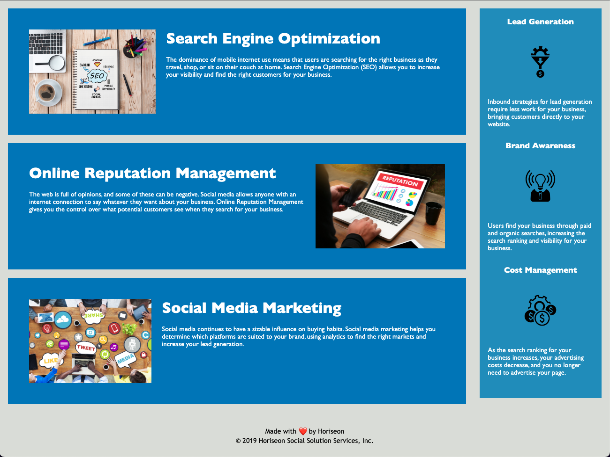

# <Horiseon Refactor Project>

## Description

The goal of this assignment is to update an example code base for a marketing agency so that the codebase follows accessibility criteria. Accessibility is important not only so that people with disabilities can access a website, but also so that the site can be better positioned in search engine results.

To this end, my updates fell into 5 main categories:
1. Replacing non-semantic HTML elements (such as div or span) with semantic elements. This also allowed me to remove many classes and ids that were being used to differentiate generic divs from each other.
2. Consolidating CSS. In the original CSS, identical attributes were defined multiple times, violating the DRY principle. For example, each aside section's h3 attribute was defined separately, even though they're identical. I changed this so it is only defined once.
3. Improving structure and sequence of HTML elements. This involved ordering the main and aside sections. It also meant updating the header attributes so they proceed sequentially. 
4. Adding accessible attributes. This included adding alt tags for images, an aria-label attribute for the hero image, and a concise and descriptive website title.
5. General improvement such as adding comments and fixing URLs.

## Installation

Deployed at the following link: [https://lucygouvin.github.io/horiseon-refactor/](https://lucygouvin.github.io/horiseon-refactor/)

## Usage

## Credits

I referred to the following resources on semantic HTML:
[https://web.dev/learn/html/semantic-html/](https://web.dev/learn/html/semantic-html/)
[https://developer.mozilla.org/en-US/docs/Glossary/Semantics](https://developer.mozilla.org/en-US/docs/Glossary/Semantics)

And this resource on using aria-label instead of alt text for background images:
[https://www.davidmacd.com/blog/alternate-text-for-css-background-images.html](https://www.davidmacd.com/blog/alternate-text-for-css-background-images.html)

## License

The last section of a high-quality README file is the license. This lets other developers know what they can and cannot do with your project. If you need help choosing a license, refer to [https://choosealicense.com/](https://choosealicense.com/).
